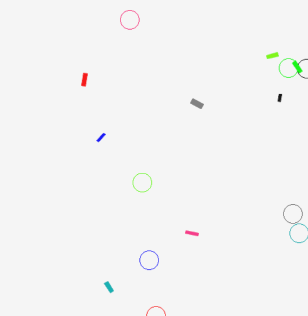
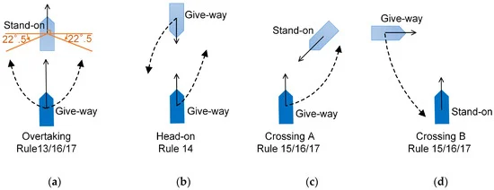
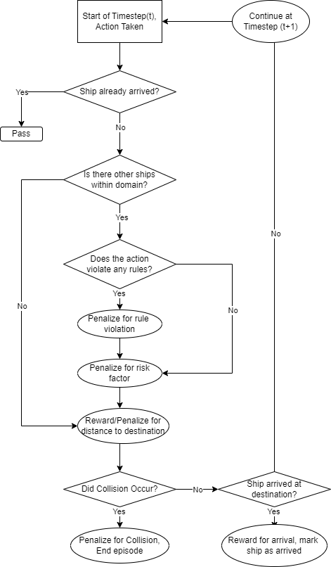
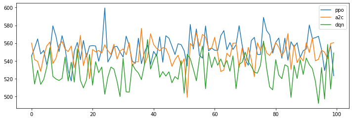
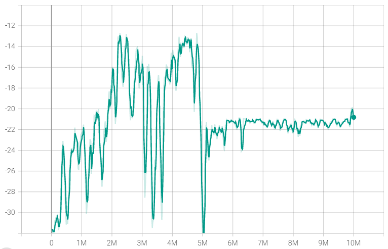

# A COLREGs-compliant multi-ship collision avoidance approach based on Deep Reinforcement Learning

**NUS IE4100R Final Year Project** · AY2022/23 Sem 2 (Mar 2023)  
**Author:** He Zhenyu (A0205505R) · **Department:** Industrial Systems Engineering and Management  
**Supervisor:** Dr. Li Haobin

Partial thesis / experiment code for autonomous **multi-ship** collision avoidance that stays aligned with **COLREGs**, trained with **deep reinforcement learning**.

<p align="center">
  
</p>
<p align="center"><em>Figure: custom Gym multi-ship environment — coloured hulls are agents, matching rings are destinations.</em></p>

## Problem

Busy seaways create high-risk encounters. COLREGs (41 rules; steering & sailing Rules 4–19 matter most here) are intentionally broad, so interpretation is often subjective. Many DRL collision-avoidance works also fall short in practice because they:

- focus on **1-to-1** encounters, or
- train a **single** ego ship against others (1-to-many), which can selfishly push risk onto neighbouring vessels

This FYP targets **multi-ship** open-sea scenarios where several agents must arrive safely **together**, while respecting give-way / stand-on behaviour in:

| Encounter | COLREGs focus |
|-----------|----------------|
| Head-on | Rule 14 — both alter to **starboard**, pass port-to-port |
| Overtaking | Rules 13/16/17 — overtaking vessel is give-way (>22.5° abaft the beam) |
| Crossing | Rules 15/16/17 — vessel with the other on her **starboard** keeps out of the way |

<p align="center">
  
</p>
<p align="center"><em>Figure: COLREGs encounter geometry used in the project (overtaking, head-on, crossing).</em></p>

## Approach

Custom Gym env (`ssship`) + Stable-Baselines3 agents (`PPO`, `DQN`, `A2C`). Ships must reach destinations while avoiding collisions, limiting encounter risk (ship domain / TCPA / DCPA-style signals), and reducing COLREGs violations.

### Environment snapshot

| Item | Detail |
|------|--------|
| Ships | `NUMBER_OF_SHIPS` up to **8**; FYP train/test focused on **4-ship** open-sea cases |
| Map | Square grid (`MAP = 200`, `SCALAR = 2` for render) |
| Episode | Up to `TIMESTEP = 2000` steps; ends on all-arrive, collision, or timeout |
| Risk | Ship domain + TCPA/DCPA helpers for continuous risk penalties |

### Observation space `(n_ships, 9)`

Per-ship feature vector as stored in the notebook:

| Idx | Feature | Notes |
|----:|---------|--------|
| 0–1 | `x`, `y` | Position |
| 2 | `speed` | Spawned ~`[0.5, 1.5]` |
| 3 | `bearing` | Heading degrees |
| 4–5 | `Lx`, `Ly` | Destination |
| 6 | `arrived` | `0` / `1` |
| 7–8 | `length`, `width` | Ship size |

### Action space (per ship, each step)

| Id | Effect |
|---:|--------|
| 0 | Steer **+15°** |
| 1 | Steer **−15°** |
| 2 | Accelerate (`+0.1`) |
| 3 | Decelerate (`−0.1`) |
| 4 | Do nothing |

Arrived ships stop acting. Motion uses simplified kinematics (immediate effect of actions — an explicit FYP assumption).

### Reward / timestep logic

Each step combines time penalty, arrival reward, collision terminate+penalty, proximity risk, destination distance shaping, and COLREGs-related penalties for bad head-on / crossing / overtaking choices.

<p align="center">
  
</p>
<p align="center"><em>Figure: per-timestep reward / termination flow (arrival, domain risk, rule violation, collision).</em></p>

**Action masking** (hard-block illegal COLREGs actions instead of only penalising) was also studied as an alternative.

## Results highlights

From the FYP evaluation narrative (not a full metrics dump):

- Agents were stress-tested over **large numbers of random 4-ship episodes**, scoring collisions, arrivals, COLREGs violations, and time-to-all-arrive
- **Reward shaping** mattered as much as the algorithm: too-complex COLREGs/ship-domain terms hurt convergence within the **~30M** step budget; overly harsh time or collision weights produced undesired behaviours (circling, over-avoidance, intentional early collision)
- Among SB3 baselines in the notebook experiments, **PPO** generally looked strongest vs **A2C** / **DQN** in comparative runs
- Action masking cut COLREGs violations but **raised collisions** in the reported test setup — soft penalties generalised better for safety in that comparison

<p align="center">
  
</p>
<p align="center"><em>Figure: comparative training traces for PPO, A2C, and DQN.</em></p>

<p align="center">
  
</p>
<p align="center"><em>Figure: example long-horizon training reward curve (~10M steps) showing exploration volatility then a more stable regime.</em></p>

## Repo contents

| Path | Role |
|------|------|
| `HEZHENYU_fypcodeused.ipynb` | Env, TCPA/DCPA + COLREGs helpers, training loops |
| `docs/images/` | Figures from the FYP report (encounters, reward flow, sim, training) |
| `README.md` | Overview |

> Partial project code — not a full paper release. Full report / slides live outside this repo.

## Quick start

```python
TIMESTEP = 2000
NUMBER_OF_SHIPS = 4   # max 8
SCALAR = 2
MAP = 200
```

1. Install notebook deps (`gym`, `numpy`, `torch` / `tensorflow`, `stable-baselines3`, `matplotlib`, `pygame`, …).
2. Open `HEZHENYU_fypcodeused.ipynb` and run env / training cells.

## Limitations

- 4-ship open-sea focus; simplified immediate-action dynamics
- Training compute capped (~30M steps discussed in the FYP)
- More realistic ship physics left as future work

## Citation / context

**IE4100R** B.Eng dissertation · Department of ISEM · NUS · presentation **9 Mar 2023**
